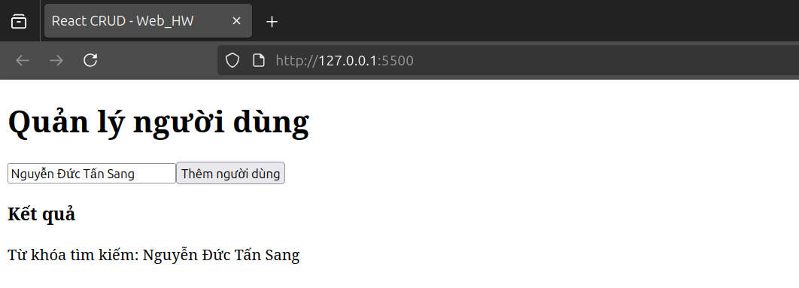
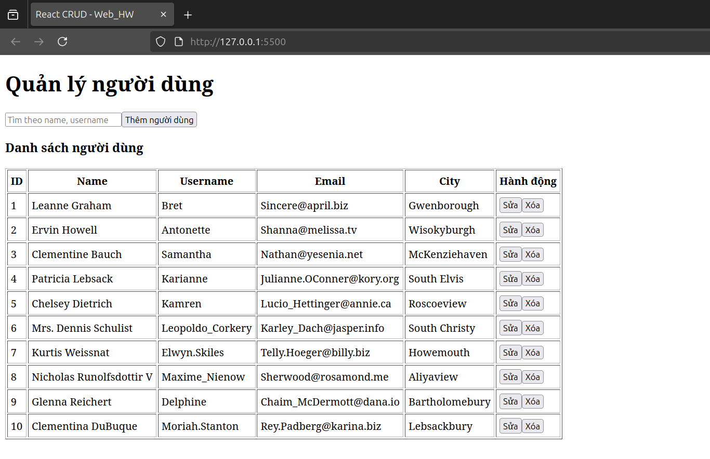
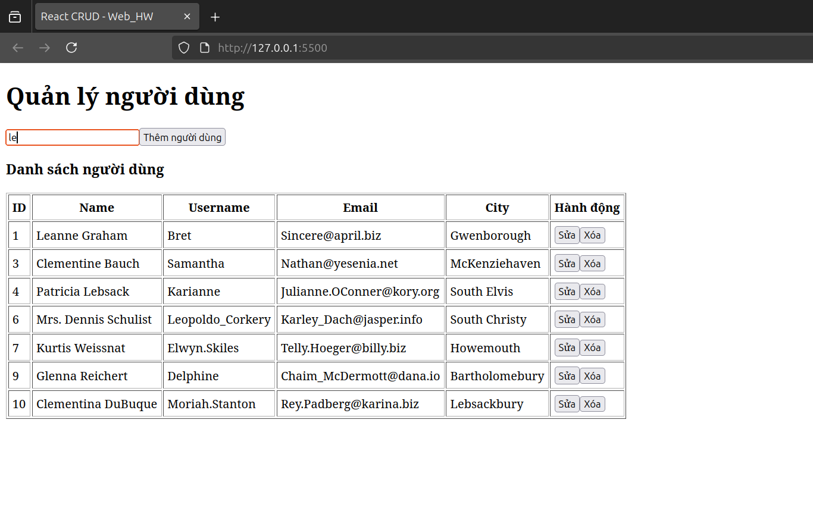
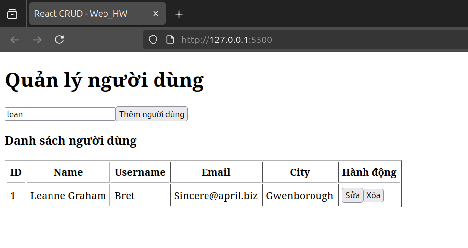
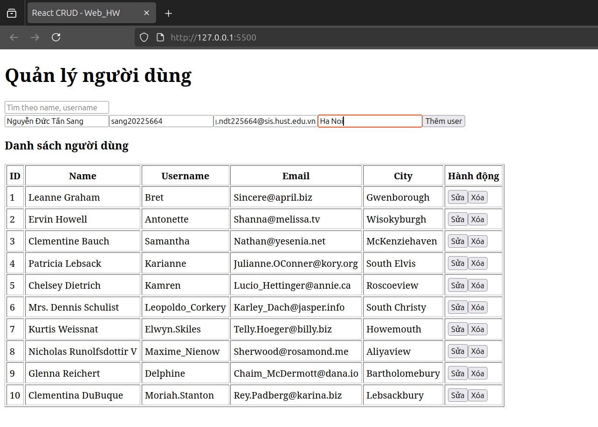
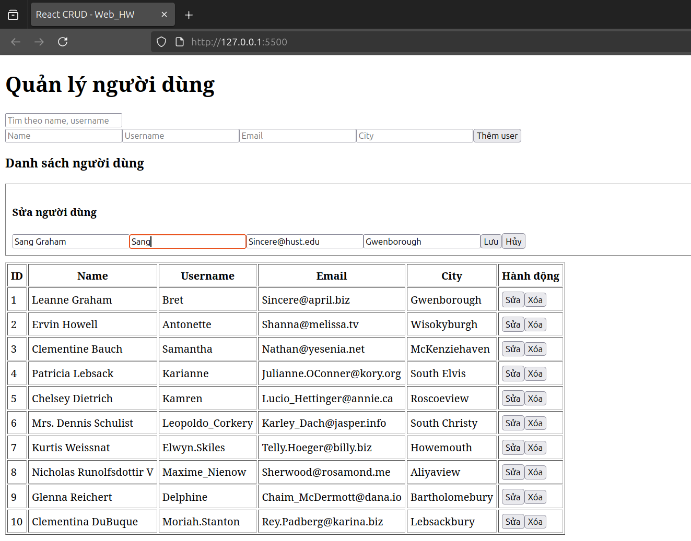
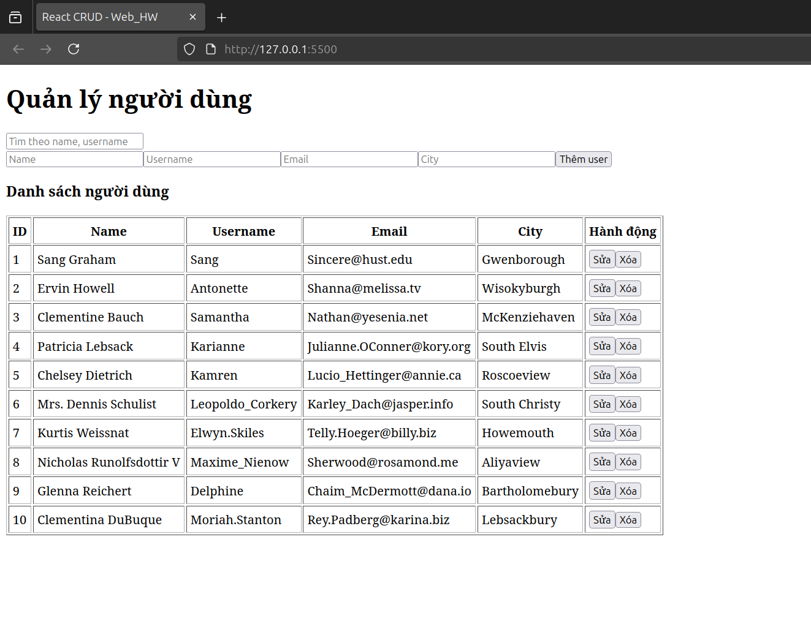

# Bài tập React CRUD

## 🧭 Giới thiệu
Ứng dụng React CRUD cơ bản – làm theo hướng dẫn tài liệu “Lập trình React cơ bản”.

---

## 🚀 Bước 1 – Thiết lập cấu trúc React cơ bản
- Tạo file `index.html` với thẻ `

`.
- Thêm CDN React, ReactDOM, Babel.
- Tạo component App và render vào root.

📸 **Kết quả:**

---

## ⚙️ Bước 2 – Tổ chức Component và State tập trung
- Tạo 3 component: `SearchForm`, `AddUser`, `ResultTable`.
- Quản lý state tại `App`.
- Dữ liệu truyền 1 chiều cha → con qua props.

📸 **Kết quả:**

---

## 🧠 Bước 3 – Chức năng Tìm kiếm
- Tạo input ở `SearchForm`
- Gửi giá trị người dùng nhập lên `App` qua callback `onChangeValue`
- `App` cập nhật state `kw` và truyền xuống `ResultTable`
- Tạm thời chỉ hiển thị keyword (lọc thực hiện ở bước 4)

📸 **Kết quả:**
Không thay đổi giao diện nhiều, nhưng khi nhập text, keyword hiển thị bên dưới bảng.

---

## 📦 Bước 4 – Hiển thị danh sách (ResultTable)

- Dùng `useEffect()` để gọi API một lần khi component mount.
- Lưu dữ liệu vào state `users`.
- Dùng `Array.filter()` để lọc theo `keyword`.
- Render bảng bằng `map()`.

📸 **Kết quả:**

---

## 🏗️ Bước 5 – Thêm người dùng (AddUser)

- Tạo form nhập user (controlled inputs)
- Tạo object `newUser` khi nhấn nút
- Truyền lên App qua `onAdd(newUser)`
- App truyền user xuống `ResultTable`
- ResultTable cập nhật state users và re-render

📸 **Kết quả:** 

---

## ✏️ Bước 6 – Sửa người dùng (Edit)

- Click nút **Sửa** để mở form edit
- Deep Copy object user để tránh mutate dữ liệu gốc
- Update nội dung bằng controlled input
- Lưu lại bằng `Array.map()` để thay user theo id

📸 **Kết quả:** (ảnh step6.png)

