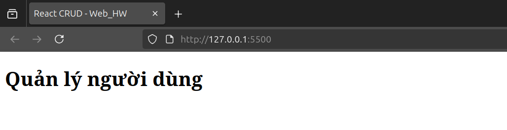
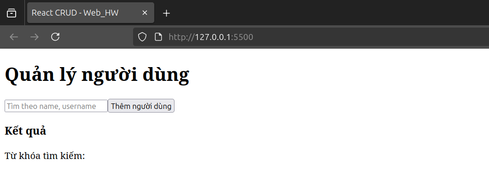

# Bài tập React CRUD

## 🧭 Giới thiệu
Ứng dụng React CRUD cơ bản – làm theo hướng dẫn tài liệu “Lập trình React cơ bản”.

---

## 🚀 Bước 1 – Thiết lập cấu trúc React cơ bản
- Tạo file `index.html` với thẻ `

`.
- Thêm CDN React, ReactDOM, Babel.
- Tạo component App và render vào root.

📸 **Kết quả:**

---

## ⚙️ Bước 2 – Tổ chức Component và State tập trung
- Tạo 3 component: `SearchForm`, `AddUser`, `ResultTable`.
- Quản lý state tại `App`.
- Dữ liệu truyền 1 chiều cha → con qua props.

📸 **Kết quả:**

---

## 🧠 Bước 3 – Chức năng Tìm kiếm
